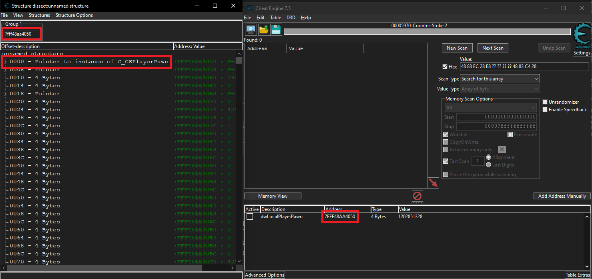
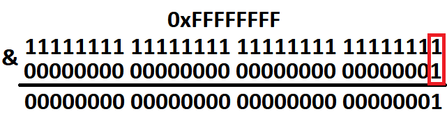
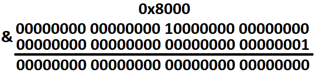
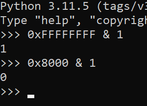
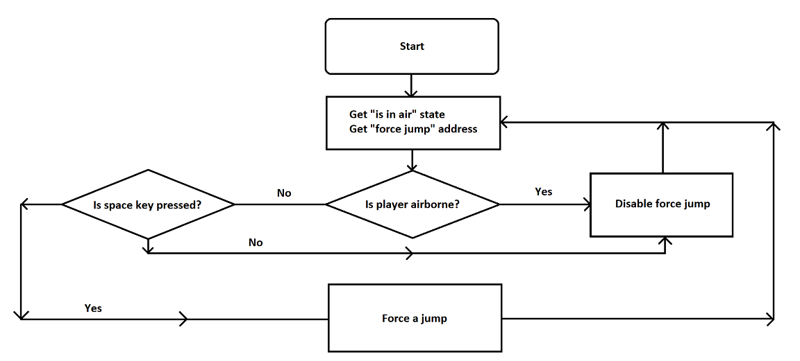

# cs2-go-bhop analysis and creation

## Writing and reading process' memory using Go

### Implementing `WriteProcessMemory()` call
Almost every cheat requires at least read access to target's memory so it can analyse it and do something. The problems began to appear at the first glance on the language: there are no native support for WinAPI functions. However, there are some wrappers like [w32](https://pkg.go.dev/github.com/allendang/w32) or [windows](https://pkg.go.dev/golang.org/x/sys/windows).\
Let's see how does `WriteProcessMemory()` looks like in [w32](https://pkg.go.dev/github.com/allendang/w32):
```
func WriteProcessMemory(hProcess HANDLE, lpBaseAddress, lpBuffer, nSize uintptr) (int, bool) {
	var nBytesWritten int
	ret, _, _ := procWriteProcessMemory.Call(
		uintptr(hProcess),
		lpBaseAddress,
		lpBuffer,
		nSize,
		uintptr(unsafe.Pointer(&nBytesWritten)),
	)

	return nBytesWritten, ret != 0
}
```
We see the same things as we can see in native `WriteProcessMemory()` function. Same set of arguments, same return value:
```
BOOL WriteProcessMemory(
  [in]  HANDLE  hProcess,
  [in]  LPVOID  lpBaseAddress,
  [in]  LPCVOID lpBuffer,
  [in]  SIZE_T  nSize,
  [out] SIZE_T  *lpNumberOfBytesWritten
);
```
To avoid getting dependencies into project, we can just copy and paste this function to our project:
```
func wpm(process uintptr, baseAddress uintptr, buffer *byte, size uintptr, numberOfBytesWritten *uintptr) (err error) {
	ret, _, err := procWriteProcessMemory.Call(uintptr(process),
		uintptr(baseAddress),
		uintptr(unsafe.Pointer(buffer)),
		uintptr(size),
		uintptr(unsafe.Pointer(numberOfBytesWritten)))

	if ret == 0 {
		return err
	}
	return nil
}
```
`process` being `uintptr` is normal: `HANDLE` is literally `uintptr` according to w32's documentation. Apart from that, rather than returning just `BOOL` without telling what happened to the function, we can just return `error` and ignore it later on in code if it's `nil`.
> Yes, `wpm()` literally stands for `WriteProcessMemory()`

### Making a wrapper for `wpm()`
Right now, calling `wpm()` would be a pain in the back: to pass C-like `*byte` you will have to create buffer, then get first item and a pointer to it, which is just too much stuff going on. An easier way would be a wrapper function. In my case, I've decided to take some inspiration from [lemonhook](https://gitlab.com/sc6ut/lemonhook/-/blob/rework/src/mem.cpp) and rewrite functions from there on Go.\
Lemonhook uses two functions to write memory: `safe_set()` and `safe_copy()`. They also include `unprot()` which is just a `VirtualProtect()` call, we'll implement it too:
```
func unprot(handle uintptr, dest uintptr, size int) (old_protect uint32) {
	virtprot(handle, dest, size, PAGE_EXECUTE_READWRITE, &old_protect)
	return old_protect
}
```
```
func prot(handle uintptr, dest uintptr, size int, old_protect uint32) {
	var dummy uint32
	virtprot(handle, dest, size, old_protect, &dummy)
}
```
> `virtprot()` is my implementation of `VirtualProtectEx()`, nothing special.\
> Why no error return? `VirtualProtectEx()` always never fails, so there's no point of doing that.

Now, `unprot()` will change the protection to preferable state and `prot()` will turn the protection back on after it gets out of scope. For that, we will use `defer` keyword:
```
func safe_copy(handle uintptr, dest uintptr, data []byte, size uint) (err error) {
	// Unprotect memory to avoid access violation
	old_protect := unprot(handle, uintptr(dest), int(size))
	defer prot(handle, uintptr(dest), int(size), old_protect)

	return wpm(handle, uintptr(dest), &data[0], uintptr(size))
}
```
And **there we go!** Wrapper for `wpm()` is done. `safe_set()` works pretty much the same, except it takes single byte rather than an array of bytes and just fills memory of some size with that same byte. Can be useful to NOP something, for example.

### `safe_copy()` usage
We still have to somehow put some integer value into byte array in byte representation **and** little-endian order. Of course, we can use `binary.LittleEndian.PutUint16()` or `.PutUint32()` or `.PutUint64()`, but now we can not have an array of size, for example, three bytes with some value above two bytes cap, but below three bytes (basically `2^16 < value < 2^24-1`). So, we have to find a workaround:
```
func put_bytes(value uint64) []byte {
	if value == 0 {
		return []byte{0}
	}

	// Determine the size of array
	var size int
	temp := value
	for temp > 0 {
		size++
		temp >>= 8 // Shift `value` by 8 bits (1 byte) to the right to read next byte
	}

	// Make an array and fill it with bytes in little-endian order
	byte_array := make([]byte, size)
	for i := 0; i < size; i++ {
		byte_array[i] = byte(value >> (8 * i))
	}

	return byte_array
}
```
`put_bytes()` easily handles any value below 64-bit cap and puts it into a byte array with an appropriate size. Now, we can call `safe_copy()` without worrying about putting our value into byte array by hand:
```
safe_copy(some_handle, some_address, put_bytes(0x12345), some_size)
```

### What about reading memory?
The process is pretty much the same. Write `rpm()` based off w32 library:
```
func rpm(process uintptr, baseAddress uintptr, buffer *byte, size uintptr) (err error) {
	var numberOfBytesRead *uintptr

	ret, _, err := procReadProcessMemory.Call(uintptr(process),
		uintptr(baseAddress),
		uintptr(unsafe.Pointer(buffer)),
		uintptr(size),
		uintptr(unsafe.Pointer(numberOfBytesRead)))

	if ret == 0 {
		return err
	}
	return nil
}
```
Make a `read()` function based off `safe_copy()`:
```
func read(handle uintptr, dest uintptr, size uint) (data []byte, err error) {
	// Unprotect memory to avoid access violation
	old_protect := unprot(handle, uintptr(dest), int(size))
	defer prot(handle, uintptr(dest), int(size), old_protect)

	data = make([]byte, size)

	err = rpm(handle, uintptr(dest), &data[0], uintptr(size))
	return data, err
}
```

## Figuring out how bhop hacks work
Easiest way to learn something new is to start with something already existing and breaking it down to smaller steps. In this case, I used knowledge from [CS2_External](https://github.com/TKazer/CS2_External/blob/master/CS2_External/Bunnyhop.hpp) project by [TKazer](https://github.com/TKazer) to build a small plan:
1. Get player flags (not that easy apparently)
2. Check if player's in air and holding space (it's fine)
3. Force jump (what the fuck?)

### Getting player flags (particularly: "being airborne" flag)
Let's switch up from Golang to Cheat Engine for a little bit. Getting airborne flag can be done in two different ways: using entity `m_fFlags` or using `m_hGroundEntity`. Both options are great, but first one is more canonical, so we'll see how both of them are working.
> To find info on offsets and names use [cs2-dumper](https://github.com/a2x/cs2-dumper/)

`m_fFlags` and `m_hGroundEntity` are both parts of `C_BaseEntity`, or just `dwLocalPlayerPawn`. The way we can inspect `C_BaseEntity` ingame is using CE's data structure's dissection.\
Open CE, attach `cs2.exe`, get `dwLocalPlayerPawn` via adding address manually (use [`client.dll + 0x1874050`](https://github.com/a2x/cs2-dumper/blob/main/output/offsets.hpp#L20)). Open `Memory View`, hit `Ctrl+D`, in the `Group 1` field paste the address you got from adding `dwLocalPlayerPawn` manually, then hit `Ctrl+N` in struct dissect menu and create new structure:\
\
Now, expand first pointer and start scrolling down. The basic way to find `m_fFlags` is to scroll a little, get back to game, jump and see if something changes while you're airborne. But now we have cs2-dumper with us, so we'll take offsets from it: [`m_fFlags`](https://github.com/a2x/cs2-dumper/blob/main/output/client_dll.hpp#L5802) and [`m_hGroundEntity`](https://github.com/a2x/cs2-dumper/blob/main/output/client_dll.hpp#L5813)\
\
Highlighted values are changing only when player's airborne, do not being affected by any other value (except for `m_fFlags`, which changes when player crouches)\
If we take a look at `m_hGroundEntity` behavior, it stays at `0x00008000` when player's on ground and ramps up to `0xFFFFFFFF` when player's airborne.\
As a result, we have `(client.dll + dwLocalPlayerPawn) + m_hGroundEntity`
> `client.dll + dwLocalPlayerPawn` sitting in parentheses because it's a pointer to `C_BaseEntity`

### Check if player's in air and holding space
That's pretty easy. We already know how to get `m_hGroundEntity` value, now we just have to somehow get boolean value and figure out if player's airborne accordingly. Simplest way to do it is to use `AND` operator, which compares values bit by bit and, if bits of two values at one place are `1`, writes `1` as a result on that bit:\
\
Now let's take a look at what happens when we pass the same check on `0x8000`:\
\
This is also provable using, for example, Python:\


### Force jump
Before CS2 came out, people were using [hazedumper](https://github.com/frk1/hazedumper) to dump offsets for CS:GO and it worked just fine, also having `dwForceJump` offset search. Nowadays, we have [cs2-dumper](https://github.com/a2x/cs2-dumper/) that also does a great job in finding offsets, but doesn't support `dwForceJump` offset search. Though we still can find it using CE's scanning feature:
- Open `cs2.exe` in CE;
- Scan for an `Unknown initial value` with the `Value type` of 4 bytes;
> Optional: choose `client.dll` in `Memory Scan Options`. Won't hurt (probably) and will help CE parse addresses **a lot**;
- Open console in game, type in `+jump`, come back to CE and choose `Changed value`, then hit `Next scan`;
- Get back to game, type in console `-jump` and hit `Next scan` once again.
> You can run around the map for a little bit **without** using `+jump` or `-jump` and then hit `Next scan`, but with `Unchanged value` setting. It'll help throw off a lot of wrong addresses

#### Click [here](https://youtu.be/jl22i4RlEZs) to see video example

At the end, we'll be left with a couple of addresses that actually represent jumping action. Normally, "forcing a jump" value would be `65537` (it just doesn't change throughout versions of CS)
> Try setting different values to these addresses to find out if they can be used for forcing jumps. Some of these addresses may represent the state or some kind of a flag to `+jump` state, which is pretty much useless

In my case, offset to `dwForceJump` was `client.dll + 0x186CD60`.
> It is **not** a pointer, but a value that sits right in game memory without pointing to any structure.

## Writing bhop hack
Skipping the boring getting process' handle and opening it for future memory modifying, writing the cheat itself isn't hard. The logic of cheat goes something like this:\
\
Now, all we have to do is get these values and create some `if` statements to check for everything. Once again, we'll skip getting process' handle and `client.dll` handle, well-documented code can be found in [main.go](https://github.com/s1nhx/cs2-go-bhop/blob/main/main.go) file:
```
off_CSPlayerPawn := client + 0x1874050 // dwLocalPlayerPawn
force_jump_off := client + 0x186CD60   // dwForceJump
for {
		// Reading 8 bytes because we're dealing with 64-bit process
		C_CSPlayerPawn, err := read(hProcess, uintptr(off_CSPlayerPawn), 8)

		localplayer := binary.LittleEndian.Uint64(C_CSPlayerPawn)

		// 4 bytes is an appropriate size according to CE and cs2-dumper
		is_in_air_flag, err := read(hProcess, uintptr(localplayer+0x450), 4)

		// Two possible values:
		// 0x8000 - On ground
		// 0xFFFFFFFF - In air
		is_in_air := binary.LittleEndian.Uint32(is_in_air_flag) & 1

		if space_pressed() && is_in_air == 0 {
			time.Sleep(25 * time.Millisecond) // You might want to play around with that 25ms value
			// Forcing a jump (+jump)
			safe_copy(hProcess, uintptr(force_jump_off), put_bytes(0x10001), 4)
		} else {
			// Not forcing a jump (-jump)
			safe_copy(hProcess, uintptr(force_jump_off), put_bytes(0x1000100), 4)
		}
```
With [this](img/5.png) logic implemented, our cheat is done.
> Full code can be viewed in [main.go](https://github.com/s1nhx/cs2-go-bhop/blob/main/main.go) file.

## Trying out bhop hack
Launch CS2 from Steam **with `-insecure` launch option**, load to any map, build `.exe` file and run it.
> Loading to map before running program is pretty crucial: there are no `dwLocalPlayerPawn` in main menu

If everything did load properly, you will see `Ready to hop!` message in console and no error floodings. Get back to game, hold spacebar and enjoy **almost** perfect bunnyhop on vanilla CS2 server.
> **Almost** perfect mainly because of Valve's unique tickrate system called sub-tick. Yuck

#### Click [here](https://youtu.be/tx9O5iss2TE) to see video example

This is pretty much it. I didn't cover some functions, but they more or less well-documented in code or on [official Microsoft website](https://learn.microsoft.com/en-us/windows/win32/api/)

## Some thoughts and questions
### Why Go?
Choosing Golang wasn't intentional. At start I wanted to have a programming language that supported building into `.DLL` file, though I quickly realised that with Go it, apparently, wouldn't be possible. But the syntax and versatility of this language just forced me to give it a try, and I don't regret it. Golang is a great language with easy and noob-friendly syntax to it. Something in between C and Python.

### Any future to this project?
No. Though it is very expandable, maybe I'll just add some use cases and examples (e.g. x86 usage)

## References
[WinAPI documentation](https://learn.microsoft.com/en-us/windows/win32/api/) for WinAPI functions\
[w32](https://github.com/JamesHovious/w32) package for great examples of wrapping syscalls\
[windows](https://pkg.go.dev/golang.org/x/sys/windows) package for the same as w32\
[CS2_External](https://github.com/TKazer/CS2_External) by [TKazer](https://github.com/TKazer) for an example of how bhop cheat should look like\
[This man](https://youtu.be/zTPk00TSzS0?t=790) with force jump explanatory\
[hazedumper](https://github.com/frk1/hazedumper) and [cs2-dumper](https://github.com/a2x/cs2-dumper) for offsets\
[lemonhook](https://gitlab.com/sc6ut/lemonhook) sources for examples of memory modifying functions\
[Google](https://google.com) for letting me ask the most cursed shit I've ever asked about programming

## This project was written entirely by hand
No AI involved. ChatGPT was used only to explain things throughout the writing of this project (e.g. `Uvarint` usage cases, compiling Go to `.DLL`, bit shifting and etc), **not to write code**. 
